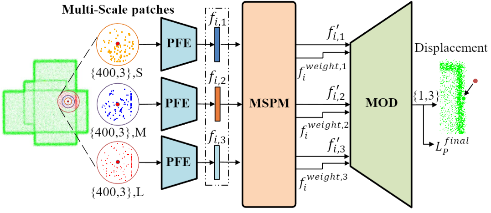

# MODNet: Multi-offset Point Cloud Denoising Network Customized for Multi-scale Patches(PG2022)

This is our implementation of MODNet, a network that employs multi-scale geometric perception information to guide the network to utilize multi-scale information.
<p align="center">  </p>


## Environment
* Python 3.6
* PyTorch 1.5.0
* CUDA and CuDNN (CUDA 10.1 & CuDNN 7.5)
* TensorboardX (2.0) if logging training info. 

Clone this repository:
``` bash
git clone https://https://github.com/hay-001/MODNet.git
cd MODNet
```

Compile Chamfer Opertors (only for evaluation)
``` bash
cd ./MODNet/Customer_Module/chamfer_distance
python setup.py install
```

## Train
Use the script `train.py` to train a model in the our dataset (the re-trained model will be saved at `./Summary/Train`):
``` bash
cd MODNet
python train.py
```

## Test with Re-trained Model
Before running the `test.py`, you should copy the re-trained model `model_full_ae_x.pth` to `./Summary/pre_train_model` and rename it to `model_full_ae.pth`.
Use the script `test.py` to test our test dataset (the results will be saved at `./Summary/Test`):
``` bash
cd MODNet
python test.py
```
  
## Evaluation（CD、MSE）
Before running the `eval.py`, the results should be saved at `./Summary/Test`:
``` bash
cd MODNet
python eval.py
```

## Evaluation（P2M）
Before running the `eval_p2m.py`, the results should be saved at `./Summary/Test`.
You may need to recreate a envs(see：https://github.com/luost26/score-denoise) to run this script `eval_p2m.py`.

``` bash
cd MODNet
python eval_p2m.py
```

## Citation
If you use our work, please cite our [paper](https://arxiv.org/abs/2208.14160)


## Acknowledgements
This code largely benefits from following repositories:
* [PointNet](http://stanford.edu/~rqi/pointnet/)
* [PCPNet](https://github.com/paulguerrero/pcpnet)
* [Pointfilter](https://github.com/dongbo-BUAA-VR/Pointfilter)
* [score-denoise](https://github.com/luost26/score-denoise)
